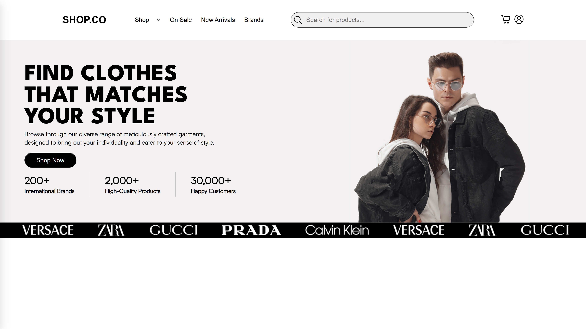
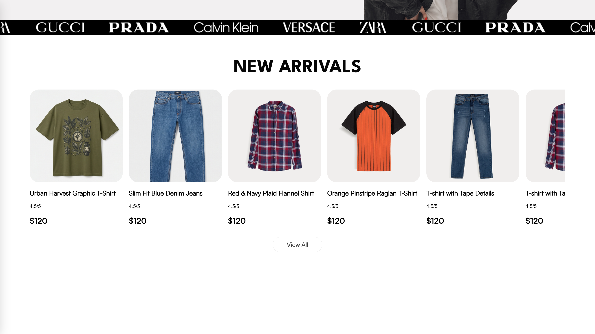
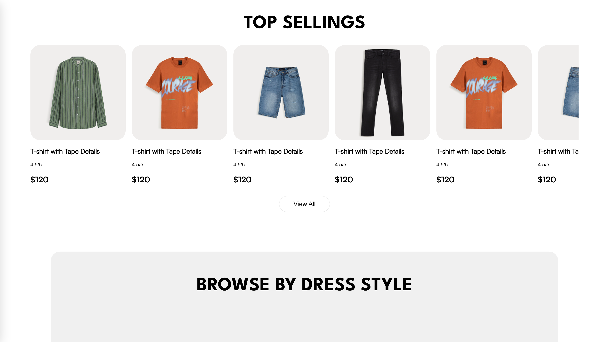
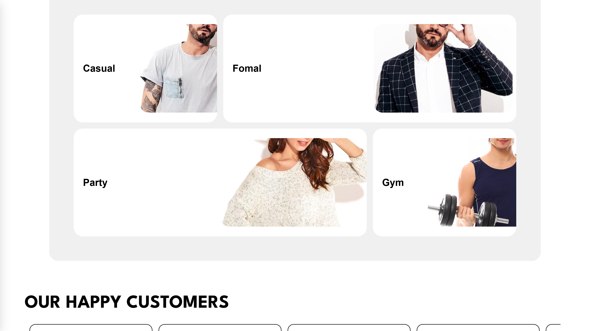
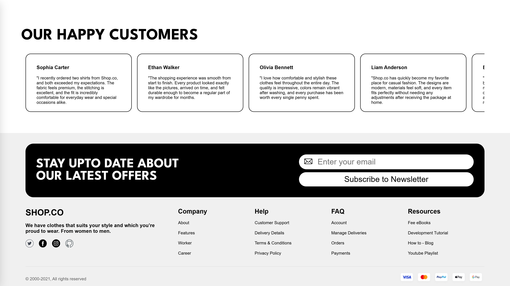
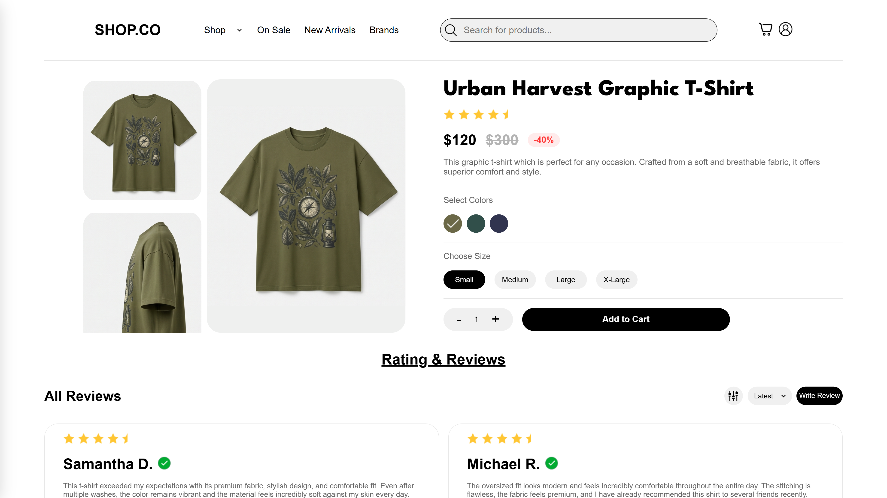
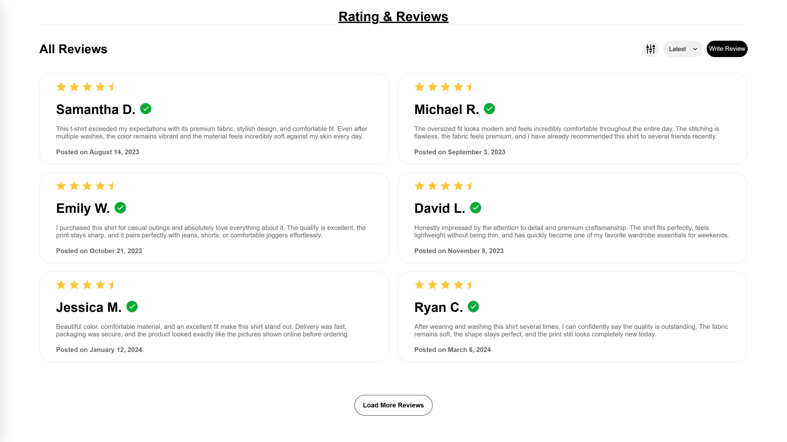
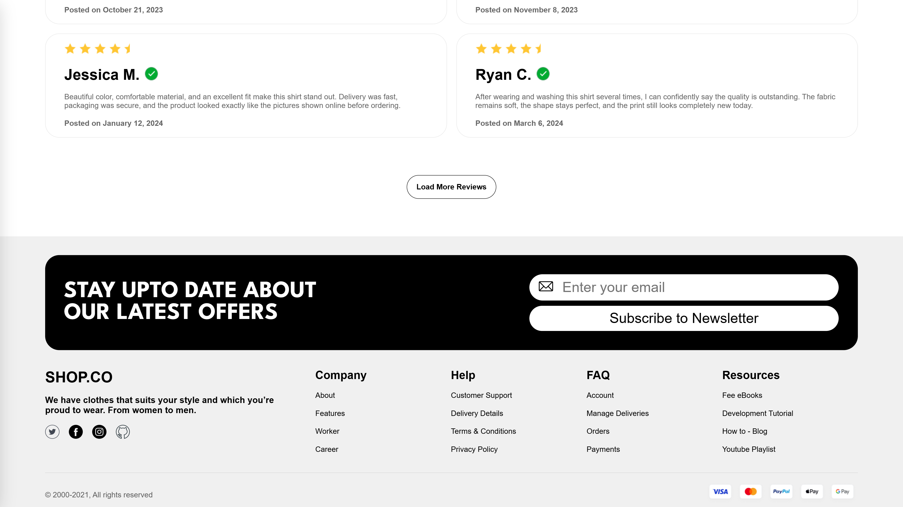

# 🛍️ Shop.co

<div align="center">

# Modern E-Commerce Frontend

### A premium, responsive and animation-rich fashion e-commerce frontend built with **HTML5**, **CSS3**, **JavaScript (ES6 Modules)** and **GSAP**.

<p>
<a href="https://rococo-moxie-c1e626.netlify.app/">🌐 Live Demo</a> •
<a href="https://github.com/Naman8859/Shop.co">💻 Repository</a>
</p>


</div>

---

# 📖 About The Project

**Shop.co** is a modern fashion e-commerce frontend inspired by premium online shopping experiences.

The project focuses on creating a polished user interface with responsive layouts, reusable JavaScript modules, scalable architecture and smooth GSAP-powered animations. It was built as a portfolio project to strengthen my frontend development skills before moving into full-stack development.

> ⚠️ Frontend only — no backend, authentication, payment system or database is included.

---

# ✨ Why I Built This Project

- Practice real-world frontend architecture
- Improve responsive UI development
- Learn GSAP & ScrollTrigger
- Organize large projects using ES6 Modules
- Prepare for React & Spring Boot development

---

# 📸 Project Showcase

## 🏠 Home Page

| Hero | New Arrivals |
|:--:|:--:|
|  |  |

| Top Selling | Browse by Dress Style |
|:--:|:--:|
|  |  |

### Customer Reviews



---

## 🛒 Product Page

| Product Details | Reviews |
|:--:|:--:|
|  |  |

### Footer



---

# 🚀 Key Features

### 🏠 Home
- Responsive Navigation
- Animated Hero Section
- Infinite Brand Marquee
- New Arrivals
- Top Selling
- Browse by Dress Style
- Customer Reviews
- Newsletter

### 🛒 Product
- Product Gallery
- Vertical Image Slider
- Color & Size Selection
- Quantity Controller
- Add to Cart Interface
- Customer Reviews

### 🎨 Animation
- GSAP Timeline
- ScrollTrigger
- Scroll-based Effects
- Responsive Animations
- Smooth Page Loading

---

# 🛠️ Tech Stack

| Layer | Technologies |
|-------|--------------|
| Frontend | HTML5, CSS3, JavaScript (ES6 Modules) |
| Animation | GSAP, ScrollTrigger |
| Tools | VS Code, Git, GitHub, Netlify |

---

# 🏗️ Architecture

```text
HTML
   │
CSS (Responsive Layout)
   │
JavaScript (ES6 Modules)
   ├── Components
   ├── Data
   ├── Utilities
   └── Animations
          │
      GSAP + ScrollTrigger
          │
Modern Responsive User Interface
```

---

# 📂 Project Structure

```text
Shop.co
├── assets/
│   ├── preview/
│   ├── ProductPage/
│   ├── DressStyle/
│   ├── ArrivalCardImages/
│   ├── SellingCardImages/
│   └── Icons/
├── css/
├── html/
├── js/
│   ├── homePage/
│   └── productPage/
├── README.md
└── .gitignore
```

---

# 📈 Highlights

- ✅ Modular ES6 Architecture
- ✅ Clean Folder Structure
- ✅ Reusable Components
- ✅ Responsive Layout
- ✅ GSAP Animations
- ✅ Easy to Maintain
- ✅ Portfolio Ready

---

# ⚡ What I Learned

- Semantic HTML5
- Modern CSS
- Flexbox & CSS Grid
- Responsive Design
- DOM Manipulation
- ES6 Modules
- Component-Based Development
- GSAP Timelines
- ScrollTrigger
- Git & GitHub
- Netlify Deployment

---

# 🎯 Challenges

- Organizing a scalable frontend structure
- Building reusable JavaScript modules
- Keeping animations responsive
- Managing assets efficiently
- Creating a premium shopping UI

---

# 🔮 Future Improvements

- Authentication
- Shopping Cart
- Wishlist
- Search & Filters
- User Profiles
- Spring Boot Backend
- REST APIs
- MySQL Database
- Payment Gateway
- Admin Dashboard

---

# 🛣️ Future Roadmap

The next step in my journey is learning:

- Java
- JDBC
- MySQL
- Spring Boot
- REST APIs
- Spring Security
- JWT Authentication

🎯 **Final Goal:** Rebuild Shop.co as a production-ready Full Stack E-Commerce application using **React + Spring Boot + MySQL**.

---

# 💻 Run Locally

```bash
git clone https://github.com/Naman8859/Shop.co.git
cd Shop.co
```

Open `html/homePage.html` using **Live Server**.

---

# 🙌 Acknowledgements

- Figma Community
- GSAP Documentation
- Modern E-Commerce UI inspiration

---

# 👨‍💻 Author

## Naman Singh Chauhan

**Frontend Developer | Java Full Stack Developer (Learning) | BCA Student**

- GitHub: https://github.com/Naman8859
- LinkedIn: https://www.linkedin.com/in/naman-singh-chauhan/

---

# ⭐ Support

If you enjoyed this project, consider giving it a **Star ⭐**.

It motivates me to continue learning, improving and building better software.

---

<div align="center">

### Thanks for visiting my repository ❤️

**Made with passion by Naman Singh Chauhan**

</div>
